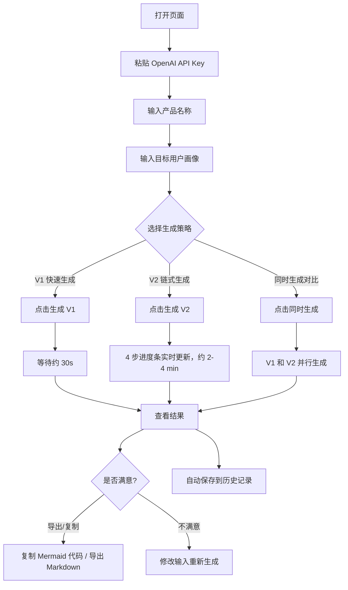
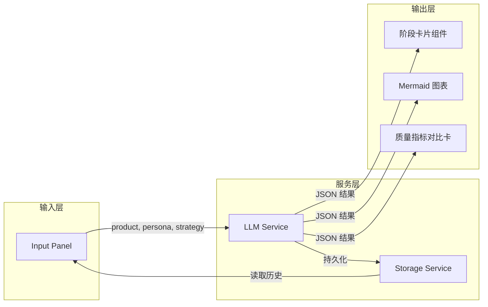
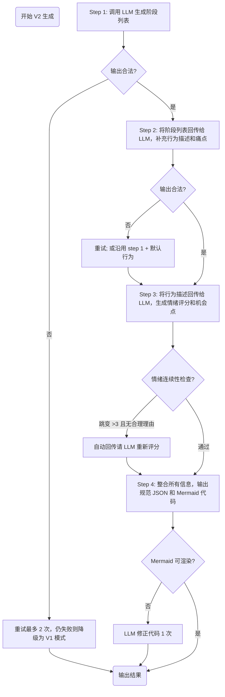

# PRD：用户旅程地图生成器（User Journey Map Generator）

> v1.0 · 2026-06-18 · 状态：规格已定，待实现

---

## 1. 项目概述

### 1.1 背景与问题

产品经理、UX 设计师和创业者在梳理用户体验时，常常需要绘制"用户旅程地图（User Journey Map）"来可视化用户从接触产品到完成核心任务的全流程。手动绘制一份完整的旅程地图存在以下痛点：

| 痛点 | 说明 |
|---|---|
| **耗时** | 手动整理 6~8 个阶段、每个阶段的行为 / 情绪 / 痛点 / 机会点，通常需要 30 分钟 ~ 2 小时 |
| **容易遗漏情绪拐点** | 人工容易忽略情绪变化的连续性，导致情绪曲线出现不合理的跳变 |
| **缺乏数据支撑感** | 纯主观的输出难以说服团队，需要结构化、可量化的呈现方式 |
| **缺少对比素材** | 当团队讨论"是否需要优化某阶段"时，没有现成的 A/B 参考 |

### 1.2 产品愿景

一个**零配置即可使用**的 AI 工具：用户只需输入产品名称和目标用户画像，即可在 30 秒 ~ 4 分钟内获得一份完整的用户旅程地图，包含结构化文本、情绪曲线图和流程图。同时支持**两种生成策略（V1 快速 / V2 高质量链式）的并排对比**，让用户直观理解"分而治之"带来的质量差异。

### 1.3 目标用户（Persona）

| 角色 | 典型画像 | 核心诉求 |
|---|---|---|
| **产品经理** | 25-35 岁，互联网公司，负责需求梳理 | 快速产出可用于评审会的 Journey Map 草稿 |
| **UX 设计师** | 25-40 岁，独立或设计团队成员 | 需要情绪曲线和痛点机会点的可视化呈现 |
| **创业者 / 作品集用户** | 需要展示 A/B 测试思维和产品方法论 | 需要一份"打开页面即能展示对比"的 demo |

### 1.4 成功指标（MVP 阶段）

- **功能可用**：输入任意合理的产品 + 画像后，至少能生成一份可阅读的结果（不因 JSON 解析错误而失败）
- **质量可控**：V2 的情绪评分跳变幅度显著小于 V1（基于内部对比评估）
- **Mermaid 可渲染**：V1 输出的 Mermaid 代码 ≥ 75% 可通过 `mermaid.parse()` 校验，V2 ≥ 90%
- **响应时间**：V1 平均 ≤ 40 秒，V2 平均 ≤ 4 分钟

---

## 2. 核心功能

### 2.1 功能模块清单

| 模块 | 说明 | 实现优先级 |
|---|---|---|
| 输入面板 | 产品名称（文本） + 用户画像（多行文本） + 生成策略选择（V1 / V2 / 同时生成） | P0 |
| API Key 管理 | 用户粘贴自己的 OpenAI Key，保存到 localStorage，不进入后端 | P0 |
| V1 生成器 | 单次调用 LLM，一次性生成完整 JSON 输出 | P0 |
| V2 生成器 | 分 4 步链式调用 LLM，逐步产出更完整和稳定的结果 | P0 |
| 阶段卡片渲染 | 将每个 stage 渲染为卡片，展示行为描述 / 情绪评分 / 痛点 / 机会点 | P0 |
| Mermaid 图表渲染 | 渲染 flowchart（旅程流程图）和 journey（情绪曲线图） | P0 |
| 质量指标对比卡 | 展示 V1 vs V2 的情绪连续性 / 阶段数 / 可渲染率 / 耗时 | P1 |
| 历史记录 | 保存最近 10 份生成结果到 localStorage，支持回看和删除 | P1 |
| 导出功能 | 一键复制 Mermaid 代码 / 导出完整 Markdown | P1 |
| 响应式布局 | 宽屏左右并排，窄屏自动堆叠 | P0 |

### 2.2 V1 vs V2 生成策略对比

| 维度 | V1（单次调用） | V2（链式 4 步） |
|---|---|---|
| **调用次数** | 1 次 LLM call | 4 次 LLM call |
| **目标** | 速度优先，快速产出可用结果 | 质量优先，逐步收敛稳定结果 |
| **Step 1** | —（与后续步骤合并在一次 prompt 中） | 阶段拆解：生成 6~8 个阶段名称 + 一句话描述 |
| **Step 2** | — | 阶段行为细化：为每个阶段补充具体行为描述 + 痛点 |
| **Step 3** | — | 情绪评分 + 机会点：基于 Step 2 的行为描述推理情绪评分和机会点 |
| **Step 4** | — | 结构化输出 + Mermaid 代码：整合前三步，生成规范 JSON + 两份 Mermaid 代码 |
| **预期质量** | 中等，可能出现情绪跳变、阶段遗漏 | 高，步骤清晰，情绪评分有连续性 |
| **适用场景** | 快速原型、头脑风暴、demo 展示的"对照组" | 正式产出、作品集展示、面试 demo 的"实验组" |

### 2.3 生成策略的 Prompt 设计原则

1. **V1 Prompt 设计为"贪心"策略**：一次性要求输出完整 JSON，让 LLM 同时承担阶段拆分、行为描述、情绪评分、图表代码生成。这个设计故意让模型"吃力"——产生的跳变和错误正是对比素材。
2. **V2 每一步只解决一个问题**：Step 1 只产出阶段列表，Step 2 只细化行为，Step 3 只基于行为给情绪分，Step 4 只做格式整理和 Mermaid 生成。
3. **V2 每一步的输入都包含上一步的输出**：确保上下文连续性，Step 3 的情绪评分明确要求"参考上一阶段得分，做 ±2 以内的调整"。
4. **统一 JSON Schema**：V1 和 V2 输出同一个 JSON 结构，确保前端可以用同一套渲染逻辑。

---

## 3. 核心流程

### 3.1 用户操作流程



### 3.2 数据流



### 3.3 V2 链式生成的详细流程



---

## 4. 数据模型

### 4.1 输出 JSON Schema

**版本标签**：`v1` / `v2`

```json
{
  "version": "v1 | v2",
  "product": "string — 用户输入的产品名称",
  "persona": "string — 用户输入的目标用户画像",
  "generatedAt": "ISO 8601 timestamp",
  "generationStats": {
    "steps": "number — 1 或 4",
    "totalTokens": "number",
    "latencyMs": "number"
  },
  "stages": [
    {
      "id": "stage-{index}",
      "name": "string",
      "summary": "string — 一句话描述该阶段",
      "emotionScore": "number — 整数 1-10",
      "emotionRationale": "string — 解释为什么给这个分数",
      "painPoint": "string — 该阶段的主要痛点",
      "opportunity": "string — 可能的优化机会点",
      "userActions": ["string — 2-3 条用户在该阶段的具体操作"]
    }
  ],
  "mermaid": {
    "flowchart": "string — Mermaid flowchart 代码",
    "emotionCurve": "string — Mermaid journey 代码"
  },
  "qualityMetrics": {
    "emotionContinuity": "number — 0-1，1 表示完全平滑",
    "stageCount": "number — stages 数组的长度",
    "mermaidSyntaxValid": "boolean"
  }
}
```

### 4.2 质量评估的计算规则（前端计算，无需 LLM）

| 指标 | 计算公式 |
|---|---|
| **emotionContinuity** | `1 - (平均相邻情绪差 / 10)`，平均相邻情绪差 = Σ|s[i+1] - s[i]| / (n-1) |
| **stageCount** | `stages.length` |
| **mermaidSyntaxValid** | `mermaid.parse(code)` 校验是否通过 |

### 4.3 localStorage 数据结构

```javascript
// key: 'ujm_history'
// value: JSON string，Array 结构，按 generatedAt 倒序，最多保留 10 条
[
  {
    "id": "ujm-{timestamp}-{random}",
    "generatedAt": "ISO 8601",
    "product": "...",
    "persona": "...",
    "v1": { /* V1 的完整 JSON 输出 */ },
    "v2": { /* V2 的完整 JSON 输出，或 null */ }
  }
]

// key: 'ujm_api_key'
// value: 用户的 OpenAI API Key（明文，仅在浏览器本地保存）
```

---

## 5. 非功能需求（NFR）

### 5.1 性能

| 指标 | 目标 |
|---|---|
| V1 首次内容生成时间 | ≤ 40 秒（含网络往返） |
| V2 首次内容生成时间 | ≤ 4 分钟 |
| 页面冷加载时间（不含 LLM 调用） | ≤ 3 秒 |
| Mermaid 图表渲染时间 | ≤ 2 秒 |

### 5.2 兼容性

- **浏览器**：Chrome / Edge / Firefox / Safari 最新两个稳定版本
- **响应式断点**：≥ 1024px 左右并排；768px - 1023px 可选择并排或堆叠；< 768px 强制上下堆叠
- **无后端依赖**：纯静态站点即可部署

### 5.3 安全与隐私

- **API Key 仅保存在用户浏览器 localStorage**，不经过任何中间服务器
- 页面不会发送任何分析 / 追踪请求（除非用户主动加 Google Analytics 等）
- 没有用户注册 / 登录体系
- **面试时的注意事项**：明确说明此项目为 demo 级别，生产环境应采用"后端代理 + 环境变量存储 Key"的方式

### 5.4 可维护性

- 所有 **Prompt 模板独立为文件**（`src/prompts/*.js`），方便后续独立迭代
- 前端组件按**职责单一**原则拆分，每个文件 ≤ 300 行
- 使用 TypeScript 或 JSDoc 注释确保类型可读性

---

## 6. 验收标准（Acceptance Criteria）

### 6.1 功能验收

**AC-1：输入与生成**
- 用户能够输入产品名称和用户画像
- 用户能够选择 V1 / V2 / 同时生成三种策略
- 点击"生成"按钮后触发生成流程，按钮在生成过程中显示 loading 状态且不可重复点击

**AC-2：V1 生成**
- 单次 LLM 调用即可生成完整 JSON
- 输出包含 5-8 个阶段，每个阶段至少有 name + emotionScore + painPoint
- 输出包含 flowchart 和 emotionCurve 两份 Mermaid 代码

**AC-3：V2 生成**
- 页面上显示 4 步进度条（Step 1 → Step 2 → Step 3 → Step 4）
- 每步完成后显示"✓ 已完成"并更新进度
- 最终输出同 V1 相同结构的 JSON，但情绪评分连续性显著优于 V1

**AC-4：结果展示**
- 阶段以卡片形式纵向排列
- Mermaid 图表在独立区域渲染
- 底部展示 V1 vs V2 质量指标对比卡（若同时生成）
- 提供"复制 Mermaid 代码"按钮和"导出完整 Markdown"按钮

**AC-5：历史记录**
- 每次生成完成后自动保存到 localStorage
- 侧边栏展示最近 10 条历史记录
- 支持点击回看和单条删除

### 6.2 质量验收

- **AC-Q1**：V2 输出的 `emotionContinuity`（基于相邻阶段情绪差计算）≥ 0.7
- **AC-Q2**：V2 输出的两份 Mermaid 代码 `mermaid.parse()` 通过率 ≥ 90%
- **AC-Q3**：V2 的阶段数 ≥ V1 的阶段数（不做硬性要求，但通常 V2 更细致）
- **AC-Q4**：页面在 1024px、768px、375px 三种宽度下均无横向滚动

### 6.3 体验验收

- **AC-UX-1**：V2 生成过程中每完成一步，立即在页面上呈现该步的结果摘要（不等全部完成再一次性展示）
- **AC-UX-2**：失败场景（LLM 返回格式异常）给出清晰的错误提示 + "重试"按钮
- **AC-UX-3**：API Key 输入框提供"眼睛图标"切换显示 / 隐藏
- **AC-UX-4**：提供 2-3 个示例输入按钮（"试试 Airbnb"/"试试 Spotify"/"试试抖音"），降低首次使用门槛

---

## 7. 范围外（Out of Scope）

- 多用户协作 / 评论系统
- 用户注册登录体系
- 后端服务器（当前版本仅前端静态站点）
- 移动端原生 App
- 多语言支持（仅中文界面，输出由 LLM 决定语言）
- 高级可视化（热力图、桑基图等超出 journey / flowchart 之外的图）
- 历史记录云端同步
