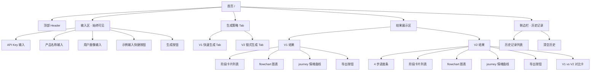

# UX Flow：用户旅程地图生成器

> 描述用户从打开页面到获得完整旅程地图的完整体验流程、每个界面的元素结构、以及边缘场景的交互设计。

---

## 1. 信息架构（Information Architecture）



---

## 2. 用户操作流程（User Task Flow）

### 2.1 主流程：首次使用

```mermaid
flowchart TD
    A[打开页面] --> B[看到欢迎文案 + 输入表单]
    B --> C{是否已有 API Key?}
    C -->|否| D[点击"粘贴我的 OpenAI Key" → 输入并保存]
    C -->|是| E[系统自动读取 localStorage]
    D --> F[输入产品名称]
    E --> F
    F --> G[输入目标用户画像]
    G --> H{是否需要示例?}
    H -->|是| I[点击"试试 Airbnb"自动填充]
    H -->|否| J[继续]
    I --> K
    J --> K[选择生成策略：V1 / V2 / 同时生成]
    K --> L[点击"生成旅程地图"按钮]
    L --> M[按钮变为 loading 状态，禁用重复点击]
    M --> N{策略是哪种?}
    N -->|V1| O[等待约 30 秒 · 显示 spinner]
    N -->|V2| P[4 步进度条逐步推进，每步完成后显示该步摘要]
    N -->|同时| Q[V1 先出，V2 继续运行 · 双栏并行展示]
    O --> R[结果渲染完成，自动滚动到结果区]
    P --> R
    Q --> R
    R --> S[自动保存到历史记录 · Toast 提示"已保存"]
    S --> T{用户操作?}
    T -->|查看 Mermaid| U[滚动到图表区域]
    T -->|复制代码| V[点击"复制 flowchart / 情绪曲线"按钮]
    T -->|导出 Markdown| W[下载 .md 文件]
    T -->|不满意| X[修改输入，重新生成]
```

### 2.2 边缘场景流程

| 场景 | 触发条件 | UI 行为 | 用户可做什么 |
|---|---|---|---|
| **LLM 超时** | 请求 > 60 秒（V1）/ > 5 分钟（V2） | 显示超时提示条，按钮恢复可点击 | 点击"重试"或修改输入 |
| **LLM 返回格式异常** | 返回的 JSON 无法被 `JSON.parse()` 解析 | 在对应 Tab 展示错误卡片："生成失败，格式异常" + 原始响应文本（可折叠展开） + "重试"按钮 | 点击重试；或复制原始文本手动分析 |
| **Mermaid 语法错误** | `mermaid.parse()` 抛出异常 | 在图表区域显示红色提示"此图表代码无法渲染"，下方显示原始代码块，提供复制按钮 | 手动复制代码到 mermaid.live 调试；或接受不完美的结果 |
| **情绪跳变过大（仅 V2）** | Step 3 输出中相邻阶段情绪差 > 3 且持续出现 | 在对比卡上用橙色"⚠️ 注意"图标高亮显示该阶段 | 面试展示时可作为讨论点 |
| **localStorage 已满** | 写入历史记录时抛出 QuotaExceededError | Toast 提示"存储空间已满，无法保存更多历史"，但结果仍会在当前页面展示 | 手动清空历史记录 |
| **用户禁用 localStorage** | 初始化时检测到不可用 | 页面顶部提示"您的浏览器禁用了本地存储，历史记录和 API Key 将不会保存" | 忽略提示，或调整浏览器设置 |
| **网络中断** | fetch 时 network error | Toast 提示"网络连接失败，请检查网络后重试" | 重新联网后点击重试 |

---

## 3. 界面元素规格（UI Element Spec）

### 3.1 顶部 Header

| 元素 | 内容 / 行为 |
|---|---|
| 产品 Logo | "🗺️ Journey Map Generator" 文字 Logo |
| 主标题 | "用户旅程地图生成器" |
| 副标题 | "输入产品和用户画像，AI 自动生成完整 Journey Map" |
| 右侧链接 | GitHub（可选） · 清空 API Key 按钮 · 清空历史按钮 |

### 3.2 输入面板（Input Panel）

```
┌──────────────────────────────────────────────────────────┐
│  🔑 API Key（已保存 · 可显示/隐藏）      [编辑]         │
├──────────────────────────────────────────────────────────┤
│                                                          │
│  📦 产品名称                                             │
│  [ Airbnb                              ]                  │
│                                                          │
│  👤 目标用户画像                                         │
│  [ 25-35 岁都市白领，首次使用 Airbnb 预订民宿的女性用户 ] │
│  [ 25-35 岁都市白领，首次使用 Airbnb 预订民宿的女性用户 ] │
│                                                          │
│  💡 试试：Airbnb   Spotify   抖音    [点一下自动填充]    │
│                                                          │
│  ⚙️ 生成策略： [V1 快速 ●] [V2 高质量 ●] [同时生成 ●]    │
│                                                          │
│  [ 🚀 生成用户旅程地图 ] ← 按钮 · 生成中变为 spinner    │
│                                                          │
└──────────────────────────────────────────────────────────┘
```

### 3.3 V1 结果展示（单栏）

```
┌─────────────────────────────────────────────────┐
│  V1 · 快速生成（单次调用）         📋 导出 Markdown │
│  耗时：28.4 秒                                    │
├─────────────────────────────────────────────────┤
│                                                   │
│  阶段 1：发现平台                                 │
│  ┌──────────────┐  情绪评分：[████░░░░░] 7/10   │
│  │ 行为描述     │                               │
│  │ 痛点         │                               │
│  │ 机会点       │                               │
│  └──────────────┘                               │
│                                                   │
│  阶段 2：注册账号                                 │
│  ┌──────────────┐  情绪评分：[███░░░░░░] 4/10   │
│  │ ...          │                               │
│  └──────────────┘                               │
│                                                   │
│  ...（6-8 个阶段卡片垂直排列）                    │
│                                                   │
├─────────────────────────────────────────────────┤
│  📊 flowchart 图表                               │
│  ┌──────────────────────────────────────────┐   │
│  │                                          │   │
│  │         Mermaid 渲染区                    │   │
│  │                                          │   │
│  └──────────────────────────────────────────┘   │
│  [📋 复制代码]                                   │
│                                                   │
│  📈 journey 情绪曲线                              │
│  ┌──────────────────────────────────────────┐   │
│  │         Mermaid 渲染区                    │   │
│  └──────────────────────────────────────────┘   │
│  [📋 复制代码]                                   │
└─────────────────────────────────────────────────┘
```

### 3.4 V2 结果展示（含 4 步进度条）

```
┌─────────────────────────────────────────────────┐
│  V2 · 链式生成（4 步 · 高质量）    📋 导出 Markdown │
│  总耗时：2m 41s                                   │
│                                                   │
│  Step 1 ──阶段拆解──► Step 2 ──行为细化──► ...    │
│  ✓ 6-8 阶段         ✓ 行为+痛点       ✓ 情绪+机会点  │
│                                                   │
│  [每步完成后，下方立即出现该步的摘要卡片]            │
│                                                   │
├─────────────────────────────────────────────────┤
│  [阶段卡片列表，同 V1]                            │
│  [flowchart 图表]                                 │
│  [情绪曲线图表]                                   │
└─────────────────────────────────────────────────┘
```

### 3.5 同时生成时的并排布局（宽屏 ≥ 1024px）

```
┌────────────────── 顶部分隔 ──────────────────┐
│  V1 · 快速生成      ||      V2 · 链式生成      │
│  28s               ||      2m 41s               │
│  ~~~~~~~~~~~~~     ||      ~~~~~~~~~~~~~~       │
│  阶段卡片          ||      阶段卡片              │
│  图表              ||      图表                  │
└─────────────────────────────────────────────────┘

[下方] V1 vs V2 质量指标对比（4 项指标并排 + 图标高亮赢家）
```

窄屏（< 1024px）自动切换为上下堆叠，且顶部增加 Tab 切换（V1 / V2）。

---

## 4. 视觉与交互设计要点

### 4.1 色彩方案

| 用途 | 颜色 | 说明 |
|---|---|---|
| 主色 | Indigo-600 (`#4f46e5`) | 品牌色，用于按钮、主要强调 |
| V1 标识 | 暖色系 Orange-500 (`#f97316`) | "对照组"的视觉标识 |
| V2 标识 | 冷色系 Sky-600 (`#0284c7`) | "实验组"的视觉标识 |
| 高分情绪（8-10） | Green-600 (`#16a34a`) | 情绪条的高分段 |
| 中分情绪（5-7） | Yellow-500 (`#eab308`) | 情绪条的中分段 |
| 低分情绪（1-4） | Red-500 (`#ef4444`) | 情绪条的低分段 |
| 背景 | White + Slate-50 | 简洁、阅读友好 |

### 4.2 排版

| 元素 | 字号 / 字重 |
|---|---|
| 主标题 | 28px / 700 |
| 副标题 | 16px / 400 |
| 阶段卡片标题 | 18px / 600 |
| 正文文本 | 15px / 400 |
| 辅助说明 | 13px / 400，slate-500 |
| 等宽代码 | 13px / 400，monospace |

### 4.3 动画与过渡

| 场景 | 动画 | 时长 |
|---|---|---|
| 按钮点击反馈 | scale 95% → 100% | 150ms |
| Tab 切换 | opacity 0 → 1 + translateY 4px → 0 | 250ms |
| 阶段卡片出现 | 交错淡入（stagger） | 每张 100ms |
| 进度条推进 | 线性增长（每步进度条独立） | 按实际耗时 |
| Toast 通知 | 右上角淡入 + 滑动 | 300ms，4s 后自动消失 |
| 图表首次渲染 | scale 0.95 → 1 + opacity 0 → 1 | 300ms |

遵循 **prefers-reduced-motion**：用户在系统中关闭动效时，所有动画降级为瞬时切换。

---

## 5. 响应式设计断点

| 断点 | 布局 | 使用场景 |
|---|---|---|
| **≥ 1200px**（桌面宽屏） | V1 / V2 左右并排，输入区在顶部独立 | 面试展示、大屏体验 |
| **1024px - 1199px**（桌面普通） | 同上，略缩小间距 | 主流桌面浏览器 |
| **768px - 1023px**（平板） | V1 / V2 默认上下堆叠，提供 Tab 切换 | 平板 / 窄屏桌面 |
| **< 768px**（手机） | 强制上下堆叠，Tab 切换，卡片横向铺满 | 移动设备 |

---

## 6. 可访问性（A11y）要点

- 所有按钮和输入框有明确的 **`aria-label`**
- 颜色对比度 ≥ **WCAG AA（4.5:1）**
- 情绪评分除颜色外，还提供**数字和文字标签**（红绿色盲友好）
- **Tab 键**可依次聚焦：API Key → 产品名称 → 画像 → 策略选择 → 生成按钮 → 第一张卡片 → ...
- 生成中按钮使用 `aria-busy="true"` 和 `disabled` 属性
- 图表区域提供 **"查看文本版本"** 的兜底选项（当 Mermaid 无法渲染或屏幕阅读器需要纯文本时）

---

## 7. 错误状态文案规范

| 错误场景 | 主标题 | 副标题 / 操作 |
|---|---|---|
| API Key 未填写 | "请先粘贴你的 OpenAI API Key" | "Key 仅保存在你的浏览器 localStorage，不会上传到任何服务器" |
| API Key 格式错误 | "API Key 看起来不太对" | "OpenAI 的 Key 通常以 `sk-` 开头，请检查是否复制完整" |
| LLM 请求超时 | "生成时间超过预期" | "可能是网络较慢或模型繁忙。点击"重试"继续" |
| LLM 返回格式异常 | "结果格式有问题，无法渲染" | "这通常是偶发的，点"重试"一般就能解决。你也可以查看原始输出来手动提取" |
| Mermaid 无法渲染 | "此图表代码无法直接渲染" | "点击"复制代码"后可在 mermaid.live 中手动调试" |
| localStorage 不可用 | "无法保存历史记录" | "你的浏览器似乎禁用了本地存储，但当前结果仍可查看和复制" |
